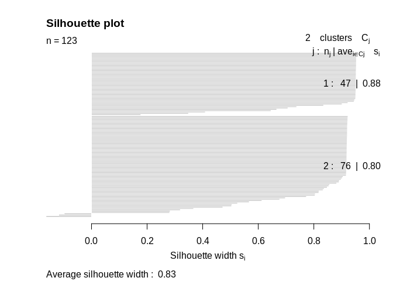
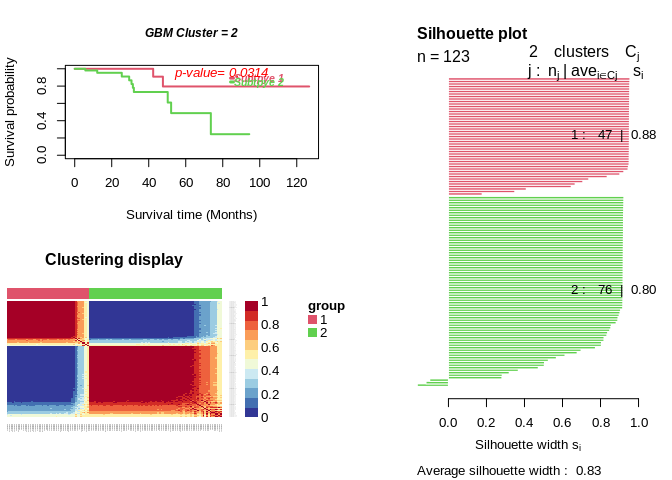
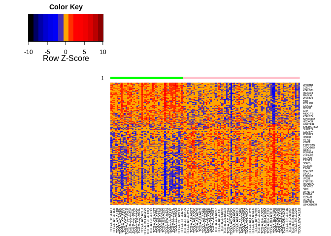

## Import data

423 normalized gene expressions for 123 ER+/HER2+ TCGA-BRCA patients


```r
setwd("~/Desktop/projects/HER2+ER2+Subyping/data")
tc.cc.data<-read.csv("Supplementary Table 1.csv",row.names=1)
tc.cc.data.t<-as.data.frame(t(tc.cc.data))
print(tc.cc.data.t[1:5,1:5])
```

```
##                    RPLP2         FAU     RPS15        RPS9       RPL13
## TCGA.3C.AALI -0.28472779  0.01916854 0.3754361 -0.49972242 -0.33954277
## TCGA.3C.AALK  0.66813004  0.74259245 0.9415252  0.51116173  0.56493613
## TCGA.A1.A0SM -0.28675269 -0.26033492 0.1484627 -0.04638799 -0.06673348
## TCGA.A1.A0SN  0.02112071  0.38019839 0.5055501  0.23080151  0.28121278
## TCGA.A2.A04X  0.20074611  0.66175295 0.5819212  0.52277280  0.82478241
```
## ExecuteCC


```r
set.seed(100)
result=ExecuteCC(clusterNum=2,d=tc.cc.data.t,maxK=10,clusterAlg="hc",distance="pearson",title="GBM")
```

## Silhouette Plot

```r
sil<-silhouette_SimilarityMatrix(result$group, result$distanceMatrix)
plot(sil)
```

<!-- -->

## Survival Analysis


```r
setwd("~/Desktop/projects/HER2+ER2+Subyping/data")
tc.surv.data<-read.csv("TCGA_survival.csv",row.names = 1)
print(tc.surv.data[1:5,])
```

```
##              vital_status    T
## TCGA.3C.AALI            0 3801
## TCGA.3C.AALK            0 1217
## TCGA.A1.A0SM            0  242
## TCGA.A1.A0SN            0 1196
## TCGA.A2.A04X            0 1349
```


```r
distanceMatrix=result$distanceMatrix
p_value=survAnalysis(mainTitle="GBM",tc.surv.data$T,tc.surv.data$vital_status,result$group,distanceMatrix,similarity=TRUE)
```

```
##                                                      
## *****************************************************
## GBM Cluster= 2   Call:
## survdiff(formula = Surv(time, status) ~ group)
## 
##          N Observed Expected (O-E)^2/E (O-E)^2/V
## group=1 47        2     5.66      2.37      4.63
## group=2 76       10     6.34      2.11      4.63
## 
##  Chisq= 4.6  on 1 degrees of freedom, p= 0.03
```

<!-- -->

## Heatmap


```r
TC_ht<-rbind(result$group,tc.cc.data)
TC_ht_sort<-TC_ht[,order(TC_ht[1,])]
col<-ifelse(TC_ht_sort[1,]==1,"green","pink")
mydist=function(c) {dist(c,method="euclidian")}
myclust=function(c) {hclust(c,method="average")}
hm <- heatmap.3(TC_ht_sort[-1,],scale = "row",dendrogram = "none",
                key=T,keysize=2,hclustfun=myclust, distfun=mydist,
                ColSideColors=t(col),
                ColSideColorsSize=1,Colv = F,Rowv = T,
                col = colorRampPalette(c("black","darkblue","blue3","blue2","blue1","orange","red","red1","red2","red3","darkred")))
```

<!-- -->


