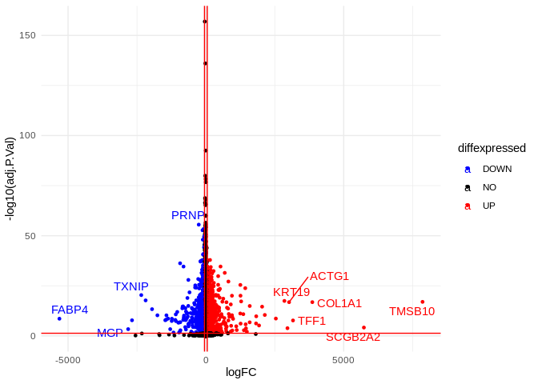
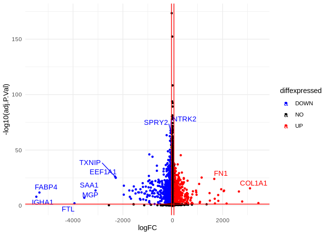

## LIMMA Volcano Plots 


```r
setwd("~/Desktop/projects/HER2+ER2+Subyping/data")
res1<-read_excel("Supplementary Table 2.xlsx", 1)
colnames(res1)[1]<-"gene"
print(res1[1:5,])
```


```r
res<-res1
res<-as.data.frame(res)
res$diffexpressed <- "NO"
res$diffexpressed[res$logFC > 50 & res$adj.P.Val < 0.05] <- "UP"
res$diffexpressed[res$logFC < -50 & res$adj.P.Val < 0.05] <- "DOWN"
res$delabel <- NA
res$delabel[res$diffexpressed != "NO"] <- res$gene[res$diffexpressed != "NO"]
see=ggplot(data=res, aes(x=logFC, y=-log10(adj.P.Val), col=diffexpressed, label=delabel)) +
  geom_point(size = 1) + 
  theme_minimal() +
  geom_text_repel() +
  scale_color_manual(values=c("blue", "black", "red")) +
  geom_vline(xintercept=c(-50, 50), col="red") +
  geom_hline(yintercept=-log10(0.05), col="red")
print(see)
```

<!-- -->


```r
setwd("~/Desktop/projects/HER2+ER2+Subyping/data")
res2<-read_excel("Supplementary Table 2.xlsx", 2)
colnames(res2)[1]<-"gene"
```


```r
res<-res2
res<-as.data.frame(res)
res$diffexpressed <- "NO"
res$diffexpressed[res$logFC > 50 & res$adj.P.Val < 0.05] <- "UP"
res$diffexpressed[res$logFC < -50 & res$adj.P.Val < 0.05] <- "DOWN"
res$delabel <- NA
res$delabel[res$diffexpressed != "NO"] <- res$gene[res$diffexpressed != "NO"]
see=ggplot(data=res, aes(x=logFC, y=-log10(adj.P.Val), col=diffexpressed, label=delabel)) +
  geom_point(size = 1) + 
  theme_minimal() +
  geom_text_repel() +
  scale_color_manual(values=c("blue", "black", "red")) +
  geom_vline(xintercept=c(-50, 50), col="red") +
  geom_hline(yintercept=-log10(0.05), col="red")
print(see)
```

<!-- -->

