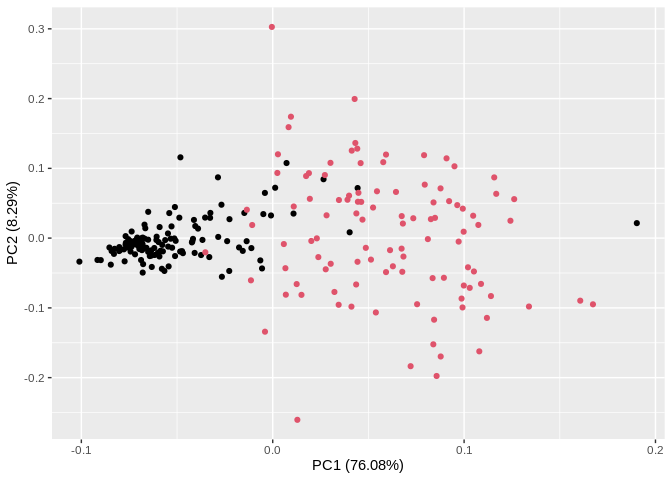
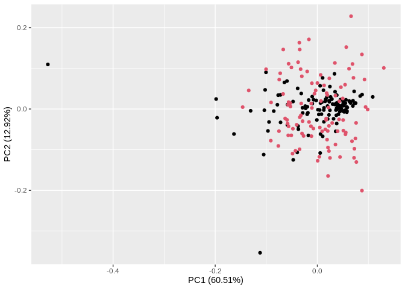
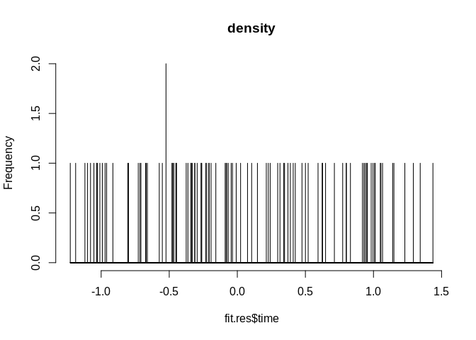

Import and combine 6 gene expression data for 123 TCGA and 104 METABRIC HER2+ER+ samples 


```r
setwd("~/Desktop/projects/HER2+ER2+Subyping/data")
tc.gene6.rs.data<-read.csv("TCGA_gene6_data.csv",row.names = 1)
tc.gene6.rs.scale.data<-apply(tc.gene6.rs.data[,-1], MARGIN = 2, FUN = function(X) (X - min(X))/diff(range(X)))
mb.gene6.rs.data<-read.csv("MB_gene6_data.csv",row.names = 1)
mb.gene6.rs.scale.data<-apply(mb.gene6.rs.data, MARGIN = 2, FUN = function(X) (X - min(X))/diff(range(X)))
rs.data<-rbind(tc.gene6.rs.scale.data,mb.gene6.rs.scale.data)

ntc<-nrow(tc.gene6.rs.data)
nmb<-nrow(mb.gene6.rs.data)
rs.data.source<-c(rep("1",ntc),rep("2",nmb))
```

PCA plot of combined data


```r
pca_res <- prcomp(rs.data, scale. = TRUE)
autoplot(pca_res, data = rs.data, colour = rs.data.source)
```

<!-- -->

Remove batch effect

```r
combat.data = ComBat(dat=t(rs.data), batch=rs.data.source, mod=NULL, par.prior=TRUE, prior.plots=FALSE)
```

PCA plot of batch effect removed data


```r
pca_res <- prcomp(t(combat.data), scale. = TRUE)
autoplot(pca_res, data = t(combat.data), colour = rs.data.source)
```

<!-- -->


```r
cluster.code<-as.factor(as.character(ifelse(tc.gene6.rs.data$cluster==2,-1,1)))

tc.gene6.rs.br.data<-as.data.frame(t(combat.data[,1:ntc]))
tc.gene6.rs.br.data$cluster<-cluster.code

mb.gene6.rs.br.data<-as.data.frame(t(combat.data[,(ntc+1):(ntc+nmb)]))
set.seed(123) 

library(e1071)
model_svm <- svm(cluster ~ RPS15+NDUFB7+RPS9+RPL13+RPLP2+FAU, data = tc.gene6.rs.br.data,probability = TRUE)
mb.risk.score<-predict (model_svm, mb.gene6.rs.br.data,probability=TRUE,decision.values = T)
mb.risk.score<-attr(mb.risk.score,"decision.values")[,1]
```


```r
setwd("~/Desktop/projects/HER2+ER2+Subyping/data")
mb.surv.data<-read.csv("MB_survival.csv",row.names = 1)

print(mb.surv.data[1:5,])
```

```
##            T vital_status
## MB.0046  424            1
## MB.0048 1594            0
## MB.0120  872            1
## MB.0130 1870            0
## MB.0165 1429            0
```

```r
print(mb.risk.score)
```

```
##     MB.0434     MB.0371     MB.0389     MB.0895     MB.0165     MB.0589 
## -0.20925881 -0.15784813 -0.06664589  0.07492097  0.10527753  0.22744832 
##     MB.0373     MB.0225     MB.0236     MB.0662     MB.0291     MB.0465 
##  0.62623936 -0.03545309 -0.37544479  0.24141453  0.71283356 -0.31237885 
##     MB.0630     MB.0307     MB.0120     MB.4688     MB.4729     MB.4796 
##  0.62406863  0.99679951  0.91909028 -0.33869728 -0.95970113 -0.57326251 
##     MB.5212     MB.4908     MB.4858     MB.4930     MB.5238     MB.4644 
## -0.08299914 -1.03217712 -0.80461950  0.62486571  1.05019766 -1.00946455 
##     MB.4878     MB.5195     MB.5266     MB.5078     MB.4276     MB.5331 
## -1.18737508  0.59282003 -0.46622147 -0.33837348 -0.66049666 -0.52377335 
##     MB.5147     MB.5062     MB.5414     MB.4289     MB.5418     MB.5292 
## -0.32969435 -1.09992747 -0.99132396 -0.55083136 -0.44716926 -0.97080868 
##     MB.5166     MB.5540     MB.5459     MB.3361     MB.3360     MB.3272 
## -1.02659434  0.02401940  0.50034898  1.29286249  1.14095118  0.31328525 
##     MB.3235     MB.3488     MB.2983     MB.2994     MB.2984     MB.3382 
##  1.43667432  1.05469921  0.93862310  0.77388004  0.80073121 -1.11928681 
##     MB.3379     MB.3103     MB.3104     MB.2786     MB.3850     MB.3852 
##  0.34699697 -0.66938208  0.92950839  0.47497802 -0.47948736  1.06667378 
##     MB.3028     MB.0048     MB.4626     MB.4725     MB.7068     MB.2939 
## -0.26106054  0.34108418 -0.07714570 -0.79896490 -0.08928223  1.01257648 
##     MB.7001     MB.7088     MB.7115     MB.7128     MB.3031     MB.2823 
##  0.83077965 -0.26541263 -0.22469823  0.37183002  0.80012324  0.94894053 
##     MB.7287     MB.7260     MB.7046     MB.2626     MB.6157     MB.6105 
## -0.45141686  0.64802762 -1.05325985  1.34324981 -0.19280910 -0.71480198 
##     MB.5186     MB.4846     MB.5039     MB.5174     MB.6082     MB.5420 
## -1.03245300 -0.23277722 -0.00813121 -0.52370816  1.00835994  0.38927721 
##     MB.6049     MB.6113     MB.6114     MB.6334     MB.4270     MB.6048 
##  0.41046926 -0.20708082  0.52020644 -1.22683356  0.95521193 -1.07826167 
##     MB.6116     MB.4317     MB.4348     MB.6314     MB.5164     MB.0381 
## -0.36286158  0.42579904 -0.34104756  0.14774357 -0.44762747 -0.72733087 
##     MB.5332     MB.7050     MB.0388     MB.0553     MB.7296     MB.5628 
## -0.26536132 -0.91388337 -0.04501905  1.15026264 -0.31243330  0.29651589 
##     MB.0288     MB.0421     MB.0046     MB.0130     MB.0484     MB.0552 
##  0.98335901 -0.47387676 -0.67312892  0.21291436 -0.47755157  1.23038825 
##     MB.0365     MB.0652 
## -0.29479402 -0.70760649
```

```r
mb.surv.data<-cbind(mb.surv.data,mb.risk.score[order(names(mb.risk.score))])
colnames(mb.surv.data)[3]<-"risk.score"
print(mb.surv.data[1:5,])
```

```
##            T vital_status risk.score
## MB.0046  424            1 -0.6731289
## MB.0048 1594            0  0.3410842
## MB.0120  872            1  0.9190903
## MB.0130 1870            0  0.2129144
## MB.0165 1429            0  0.1052775
```

```r
fit <- survfit(Surv(risk.score, vital_status) ~ 1, data = mb.surv.data)

fit.res <- as.data.frame(tidy(fit))
fit.res
```

```
##            time n.risk n.event n.censor   estimate   std.error conf.high
## 1   -1.22683356    104       0        1 1.00000000 0.000000000 1.0000000
## 2   -1.18737508    103       1        0 0.99029126 0.009756214 1.0000000
## 3   -1.11928681    102       0        1 0.99029126 0.009756214 1.0000000
## 4   -1.09992747    101       0        1 0.99029126 0.009756214 1.0000000
## 5   -1.07826167    100       1        0 0.98038835 0.014006920 1.0000000
## 6   -1.05325985     99       0        1 0.98038835 0.014006920 1.0000000
## 7   -1.03245300     98       0        1 0.98038835 0.014006920 1.0000000
## 8   -1.03217712     97       1        0 0.97028125 0.017423608 1.0000000
## 9   -1.02659434     96       1        0 0.96017416 0.020328090 0.9992020
## 10  -1.00946455     95       1        0 0.95006706 0.022917533 0.9937147
## 11  -0.99132396     94       1        0 0.93995996 0.025290386 0.9877262
## 12  -0.97080868     93       1        0 0.92985287 0.027504194 0.9813543
## 13  -0.95970113     92       1        0 0.91974577 0.029596055 0.9746754
## 14  -0.91388337     91       1        0 0.90963867 0.031591558 0.9677422
## 15  -0.80461950     90       1        0 0.89953158 0.033509260 0.9605933
## 16  -0.79896490     89       1        0 0.88942448 0.035363142 0.9532575
## 17  -0.72733087     88       0        1 0.88942448 0.035363142 0.9532575
## 18  -0.71480198     87       0        1 0.88942448 0.035363142 0.9532575
## 19  -0.70760649     86       0        1 0.88942448 0.035363142 0.9532575
## 20  -0.67312892     85       1        0 0.87896066 0.037290855 0.9456087
## 21  -0.66938208     84       1        0 0.86849685 0.039166806 0.9377932
## 22  -0.66049666     83       1        0 0.85803303 0.040999608 0.9298287
## 23  -0.57326251     82       0        1 0.85803303 0.040999608 0.9298287
## 24  -0.55083136     81       1        0 0.84744003 0.042840272 0.9216684
## 25  -0.52377335     80       1        0 0.83684703 0.044648815 0.9133794
## 26  -0.52370816     79       1        0 0.82625403 0.046430612 0.9049725
## 27  -0.47948736     78       0        1 0.82625403 0.046430612 0.9049725
## 28  -0.47755157     77       0        1 0.82625403 0.046430612 0.9049725
## 29  -0.47387676     76       0        1 0.82625403 0.046430612 0.9049725
## 30  -0.46622147     75       1        0 0.81523731 0.048331996 0.8962400
## 31  -0.45141686     74       1        0 0.80422059 0.050210542 0.8873899
## 32  -0.44762747     73       0        1 0.80422059 0.050210542 0.8873899
## 33  -0.44716926     72       0        1 0.80422059 0.050210542 0.8873899
## 34  -0.37544479     71       0        1 0.80422059 0.050210542 0.8873899
## 35  -0.36286158     70       0        1 0.80422059 0.050210542 0.8873899
## 36  -0.34104756     69       1        0 0.79256522 0.052289839 0.8781005
## 37  -0.33869728     68       1        0 0.78090985 0.054348119 0.8686846
## 38  -0.33837348     67       1        0 0.76925448 0.056390248 0.8591510
## 39  -0.32969435     66       0        1 0.76925448 0.056390248 0.8591510
## 40  -0.31243330     65       1        0 0.75741979 0.058482858 0.8494100
## 41  -0.31237885     64       1        0 0.74558511 0.060566166 0.8395590
## 42  -0.29479402     63       1        0 0.73375042 0.062644049 0.8296045
## 43  -0.26541263     62       0        1 0.73375042 0.062644049 0.8296045
## 44  -0.26536132     61       1        0 0.72172173 0.064788123 0.8194407
## 45  -0.26106054     60       1        0 0.70969303 0.066932704 0.8091774
## 46  -0.23277722     59       1        0 0.69766434 0.069081210 0.7988193
## 47  -0.22469823     58       0        1 0.69766434 0.069081210 0.7988193
## 48  -0.20925881     57       1        0 0.68542461 0.071312669 0.7882449
## 49  -0.20708082     56       1        0 0.67318489 0.073553872 0.7775772
## 50  -0.19280910     55       1        0 0.66094516 0.075808129 0.7668200
## 51  -0.15784813     54       0        1 0.66094516 0.075808129 0.7668200
## 52  -0.08928223     53       0        1 0.66094516 0.075808129 0.7668200
## 53  -0.08299914     52       0        1 0.66094516 0.075808129 0.7668200
## 54  -0.07714570     51       1        0 0.64798545 0.078351958 0.7555419
## 55  -0.06664589     50       0        1 0.64798545 0.078351958 0.7555419
## 56  -0.04501905     49       0        1 0.64798545 0.078351958 0.7555419
## 57  -0.03545309     48       0        1 0.64798545 0.078351958 0.7555419
## 58  -0.00813121     47       1        0 0.63419853 0.081250009 0.7436787
## 59   0.02401940     46       1        0 0.62041160 0.084170397 0.7316879
## 60   0.07492097     45       1        0 0.60662468 0.087118920 0.7195746
## 61   0.10527753     44       0        1 0.60662468 0.087118920 0.7195746
## 62   0.14774357     43       0        1 0.60662468 0.087118920 0.7195746
## 63   0.21291436     42       0        1 0.60662468 0.087118920 0.7195746
## 64   0.22744832     41       0        1 0.60662468 0.087118920 0.7195746
## 65   0.24141453     40       0        1 0.60662468 0.087118920 0.7195746
## 66   0.29651589     39       1        0 0.59107020 0.090909131 0.7063518
## 67   0.31328525     38       1        0 0.57551572 0.094740212 0.6929473
## 68   0.34108418     37       0        1 0.57551572 0.094740212 0.6929473
## 69   0.34699697     36       1        0 0.55952917 0.098840065 0.6791341
## 70   0.37183002     35       1        0 0.54354262 0.103003372 0.6651357
## 71   0.38927721     34       0        1 0.54354262 0.103003372 0.6651357
## 72   0.41046926     33       0        1 0.54354262 0.103003372 0.6651357
## 73   0.42579904     32       0        1 0.54354262 0.103003372 0.6651357
## 74   0.47497802     31       1        0 0.52600899 0.108097009 0.6501379
## 75   0.50034898     30       1        0 0.50847536 0.113288961 0.6348946
## 76   0.52020644     29       0        1 0.50847536 0.113288961 0.6348946
## 77   0.59282003     28       0        1 0.50847536 0.113288961 0.6348946
## 78   0.62406863     27       0        1 0.50847536 0.113288961 0.6348946
## 79   0.62486571     26       0        1 0.50847536 0.113288961 0.6348946
## 80   0.62623936     25       1        0 0.48813634 0.120420328 0.6180778
## 81   0.64802762     24       0        1 0.48813634 0.120420328 0.6180778
## 82   0.71283356     23       1        0 0.46691302 0.128364091 0.6004816
## 83   0.77388004     22       0        1 0.46691302 0.128364091 0.6004816
## 84   0.80012324     21       1        0 0.44467907 0.137325498 0.5820206
## 85   0.80073121     20       0        1 0.44467907 0.137325498 0.5820206
## 86   0.83077965     19       0        1 0.44467907 0.137325498 0.5820206
## 87   0.91909028     18       1        0 0.41997468 0.148749004 0.5621322
## 88   0.92950839     17       1        0 0.39527029 0.160632303 0.5415326
## 89   0.93862310     16       0        1 0.39527029 0.160632303 0.5415326
## 90   0.94894053     15       0        1 0.39527029 0.160632303 0.5415326
## 91   0.95521193     14       1        0 0.36703669 0.176910266 0.5191535
## 92   0.98335901     13       1        0 0.33880310 0.194184188 0.4957209
## 93   0.99679951     12       0        1 0.33880310 0.194184188 0.4957209
## 94   1.00835994     11       1        0 0.30800282 0.216329397 0.4706463
## 95   1.01257648     10       1        0 0.27720254 0.240643967 0.4442564
## 96   1.05019766      9       1        0 0.24640226 0.267952249 0.4166065
## 97   1.05469921      8       1        0 0.21560197 0.299425367 0.3877252
## 98   1.06667378      7       0        1 0.21560197 0.299425367 0.3877252
## 99   1.14095118      6       1        0 0.17966831 0.350697710 0.3572613
## 100  1.15026264      5       1        0 0.14373465 0.415919324 0.3247825
## 101  1.23038825      4       1        0 0.10780099 0.506282744 0.2907846
## 102  1.29286249      3       1        0 0.07186732 0.650375956 0.2571180
## 103  1.34324981      2       0        1 0.07186732 0.650375956 0.2571180
## 104  1.43667432      1       0        1 0.07186732 0.650375956 0.2571180
##       conf.low
## 1   1.00000000
## 2   0.97153498
## 3   0.97153498
## 4   0.97153498
## 5   0.95383978
## 6   0.95383978
## 7   0.95383978
## 8   0.93770588
## 9   0.92267066
## 10  0.90833662
## 11  0.89450370
## 12  0.88105419
## 13  0.86791180
## 14  0.85502366
## 15  0.84235136
## 16  0.82986590
## 17  0.82986590
## 18  0.82986590
## 19  0.82986590
## 20  0.81701007
## 21  0.80432099
## 22  0.79178100
## 23  0.79178100
## 24  0.77918982
## 25  0.76672732
## 26  0.75438281
## 27  0.75438281
## 28  0.75438281
## 29  0.75438281
## 30  0.74155570
## 31  0.72884620
## 32  0.72884620
## 33  0.72884620
## 34  0.72884620
## 35  0.72884620
## 36  0.71536192
## 37  0.70200418
## 38  0.68876420
## 39  0.68876420
## 40  0.67539206
## 41  0.66212992
## 42  0.64897154
## 43  0.64897154
## 44  0.63565582
## 45  0.62243975
## 46  0.60931868
## 47  0.60931868
## 48  0.59601644
## 49  0.58280757
## 50  0.56968847
## 51  0.56968847
## 52  0.56968847
## 53  0.56968847
## 54  0.55574037
## 55  0.55574037
## 56  0.55574037
## 57  0.55574037
## 58  0.54083538
## 59  0.52605837
## 60  0.51140423
## 61  0.51140423
## 62  0.51140423
## 63  0.51140423
## 64  0.51140423
## 65  0.51140423
## 66  0.49460337
## 67  0.47798490
## 68  0.47798490
## 69  0.46098832
## 70  0.44417793
## 71  0.44417793
## 72  0.44417793
## 73  0.44417793
## 74  0.42557962
## 75  0.40722851
## 76  0.40722851
## 77  0.40722851
## 78  0.40722851
## 79  0.40722851
## 80  0.38551313
## 81  0.38551313
## 82  0.36305488
## 83  0.36305488
## 84  0.33974652
## 85  0.33974652
## 86  0.33974652
## 87  0.31376733
## 88  0.28851188
## 89  0.28851188
## 90  0.28851188
## 91  0.25949153
## 92  0.23155678
## 93  0.23155678
## 94  0.20156484
## 95  0.17296598
## 96  0.14573481
## 97  0.11988957
## 98  0.11988957
## 99  0.09035601
## 100 0.06361072
## 101 0.03996447
## 102 0.02008771
## 103 0.02008771
## 104 0.02008771
```

```r
lm.res = lm(estimate~ poly(time, 2, raw = TRUE), data = fit.res)

#plot(fit.res$time,fit.res$estimate,xlim=c(min(mb.risk.score),max(mb.risk.score)),cex = 0.5)

pred <- predict(lm.res)
ix <- sort(fit.res$time, index.return=T)$ix

#add polynomial curve to plot
plot(fit.res$time[ix], pred[ix], type="l",col='black', lwd=2,ylim=c(-0.2,1))
newx <- seq(min(fit.res$time), max(fit.res$time), length.out=length(fit.res$time))
preds <- predict(lm.res, newdata = data.frame(time=newx), interval = 'confidence')
lines(newx, preds[ ,3], lty = 'dashed', col = 'blue')
lines(newx, preds[ ,2], lty = 'dashed', col = 'blue')

quantiles <- quantile(fit.res$time, prob=c( 0.25,  0.75))

abline(v=quantiles)

par(new = TRUE)
d <- density(fit.res$time[ix]) # returns the density data
plot(d,axes=F,ylim=c(-0.2,3),xlim=c(min(mb.risk.score),max(mb.risk.score)),xlab="", ylab="",lwd=0.5)
```

<!-- -->

```r
#lines(fit.res$time,fit.res$conf.high,type="l",lty=2)
#lines(fit.res$time,fit.res$conf.low,type="l",lty=2)
hist(fit.res$time, breaks=20000, main="density",xlim=c(min(mb.risk.score),max(mb.risk.score)))
```

<!-- -->

